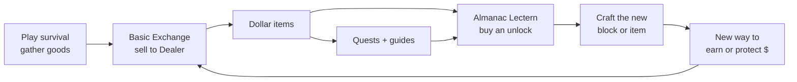
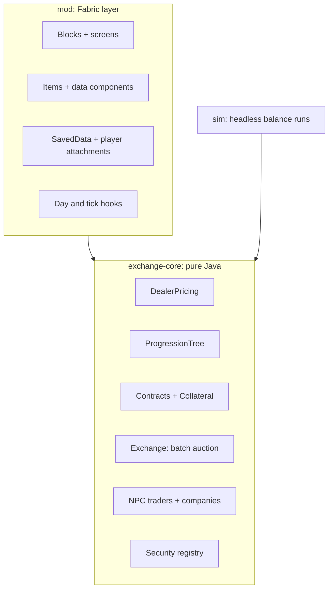

# Realistic Markets — Game Design Document

Sep 23, 2026 · @James Barry

## Overview and design pillars

Realistic Markets is a Minecraft mod that teaches how financial markets work by making the player earn their way through them: survival → selling goods for dollars → buying each new financial tool with those dollars → using that tool to earn more. Single player ships first; multiplayer follows once the systems are stable.

**Pillars**

1. **Every upgrade is purchased.** Nothing is granted by advancements or free crafting. New tools are bought with dollars at the Almanac Lectern, then crafted or received.
2. **Physical first.** Money, contracts, shares and bonds are items you hold, stack, lose and trade. Blocks use vanilla-style container screens (like a furnace or villager trade), never free-floating menus.
3. **Information and convenience are earned.** The player starts nearly blind: one quote at a time, no totals, no history. Better screens, summaries and remote access are upgrades worth buying.
4. **Learn by consequence.** A short field guide explains a concept right after the player feels it: a price crash from dumping a farm, a hedge that saved a harvest.
5. **Grounded in Minecraft value.** Prices start from how hard an item is to get, then move with supply, demand and in-game events.
6. **Can't be cheesed.** Every counterparty reacts to volume, so no single farm or loop prints unlimited money.
7. **Multiplayer-ready data.** Accounts and obligations (bank balances, unlocks, posted collateral, debts, book-entry holdings) are keyed by account and server-authoritative from day one, even in single player. Bearer papers are not: they belong to whoever holds the item, and the server only tracks whether each one is genuine and unredeemed.

The existing `exchange-core` scaffold (batch auction, escrow ledger, conservation tests) becomes the engine for Tier 3 and above.

## Core loop and progression

The loop is: gather goods, sell them to the Dealer for dollars, spend dollars at the Almanac Lectern to unlock a tool, then use that tool to earn dollars faster or more safely. Tiers follow the real historical order of finance, so each unlock feels like the next invention.



Each pass through the loop should take longer and pay more than the last, with a new concept introduced every time.

| Tier | Era | Headline unlocks | Concept taught | Unlock cost range (tuning placeholder) | Target playtime to reach |
| --- | --- | --- | --- | --- | --- |
| 0 | Barter | Basic Exchange, Almanac Lectern, dollars | Money as a medium of exchange; bid/ask spread | Crafted, no cost | First session |
| 1 | Merchant | Price Board, Bill Clip, Merchant License, Trade Route Crate | Quotes, transaction costs, arbitrage between markets | $40–$300 | \~2 h |
| 2 | Banking | Bank Vault + Passbook, Certificate of Deposit, Loan Note | Interest, compounding, leverage, collateral | $500–$2,500 | \~5 h |
| 3 | Exchange | Trading Floor, Order Slips, Newsstand, Ticker Tape | Order books, limit vs market orders, liquidity, news | $1,000–$8,000 | \~10 h |
| 4 | Equities | Stock Exchange, Share Certificates, Electronic Newsfeed, Portfolio Binder, Safe Deposit Box | Ownership, dividends, valuation, news | $5,000–$25,000 | \~15 h |
| 5 | Fixed income | Bond Desk, Treasury and Corporate Bonds, Records Terminal | Yield, rate risk, default risk, bookkeeping | $25,000–$60,000 | \~22 h |
| 6 | Forwards and futures | Forward Contracts, Clearing House, Futures | Hedging, margin, mark-to-market | $40,000–$120,000 | \~30 h |
| 7 | Options | Options Desk, Call and Put Contracts, Volatility Board | Optionality, payoff asymmetry, Greeks | $80,000–$250,000 | \~40 h |
| 8 | Modern finance | ATM + Bank Card, Brokerage Terminal | Dematerialization, custody | $300,000–$750,000 | \~60 h |

## Currency: dollars

Dollars are physical items in four denominations, and they can only enter the world through exchange blocks and financial payouts. Internally every amount is an integer number of cents; the smallest physical unit is a 10¢ coin, so unit prices can be fractional but every payout rounds to 10¢.

| Item | Value | Stack size | Notes |
| --- | --- | --- | --- |
| Dime (coin) | $0.10 | 64 | Change for crops and cheap drops |
| One-Dollar Bill | $1 | 64 |  |
| Ten-Dollar Bill | $10 | 64 |  |
| Hundred-Dollar Bill | $100 | 64 |  |

**Rules**

- Not craftable, not in loot tables, not sold by villagers. Creative inventory only for testing.
- Every exchange block pays out in the fewest items and makes change automatically, pulling bills from the player's inventory and Bill Clip. Payouts and change go into the first Bill Clip with room, then the inventory.
- Dollars drop on death like any item. This is intentional: it motivates the Bank Vault (Tier 2) and ATM (Tier 8).
- The Dealer rounds in its own favor: sale totals round down to 10¢, purchase totals round up. Players learn that rounding is a small hidden cost.

**Where dollars come from (faucets):** selling to the Dealer, interest, coupons and dividends, quest rewards, contract payouts.

**Where dollars go (sinks):** buying from the Dealer, Almanac unlock purchases (the largest sink), fees, loan interest, option premiums paid, liquidation losses.

## Basic Exchange and the Dealer

The Basic Exchange is the first mod block: a trading table where the player sells goods to, and buys goods from, one Dealer per world. The Dealer's prices fall as it accumulates an item and recover over in-game days, so a farm's income is capped by design rather than by a hard daily limit.

### The block

- **Recipe (shaped):** top row Gold Ingot, Paper, Gold Ingot; middle row Oak Planks, Crafting Table, Oak Planks; bottom row Oak Planks, Iron Ingot, Oak Planks. Any planks work.
- **Screen (vanilla container style):** a Sell tab with one input slot and a quote line (“Dealer pays $25.40 for 64 Wheat”); a Buy tab listing items the Dealer stocks with their ask; a Confirm button. Payout drops into the output slots as bills and coins.
- **In-world feedback:** holding an item near the block shows its current bid above the block, like a name tag. The block's front texture shows a small chalkboard.
- **Quick sell:** sneak + right-click with a stack sells the whole stack after a second sneak-click to confirm.
- **Starting catalog:** about 40 vanilla items in four groups (Farm, Mining, Mobs, Wood and Stone). Items not in the catalog can't be sold, which the guide explains as “no market exists for that yet.”

### Dealer pricing model

Each item has a fair value V (dollars), a market depth L (units), and the Dealer's current inventory I (units bought minus units sold; negative when the Dealer has sold more than it bought). The Dealer's mid price is:

```latex
m(I) = V \, e^{-k I / L}
```

The Dealer quotes around the mid with a spread s (20% at the Basic Exchange, 12% with a Merchant License):

```latex
\text{bid} = m(I)\,(1 - s/2) \qquad \text{ask} = m(I)\,(1 + s/2)
```

Price moves unit by unit inside a single sale, so selling n units starting from inventory I pays the integral, not n × bid:

```latex
P(n) = V\,(1 - s/2)\,\frac{L}{k}\,e^{-kI/L}\left(1 - e^{-kn/L}\right)
```

Between trades the Dealer offloads stock to the outside world, so inventory decays toward zero with recovery time τ (2 in-game days by default):

```latex
I(t) = I_0 \, e^{-t/\tau}
```

Fair value V moves on its own, so prices change even when the player does nothing, and nothing snaps them back (M5c):

- **Random walk with trends.** Each in-game day log V takes a random step (about 2%) plus a trend that itself wanders and lasts a week or two, so prices can climb or slide for days.
- **A weak anchor.** Log V is pulled toward the catalog value with a 60-day half-life, so a long save stays sane: 95% of the time within about ±43% of the catalog value. A typical month moves 10%; one month in ten, over 24%.
- **Supply and demand.** Every depth's worth sold to the Dealer lowers V by 1% for good (buying raises it). The Dealer's inventory still recovers in days (below), so part of a dump's price drop comes back and part never does: a huge single-item farm slowly depresses its own market.
- **World events.** 25 kinds in `events.csv`: rare big shocks to whole groups (bumper harvest, drought, mine collapse, building boom) and common small stories about one market (a smiths' strike, a potato glut, a tannery fire). About 1.1 a day, so two days in three bring news and silence rarely lasts a week. Each has a transient shock (±18-35%, scaled 0.5-1.5× per event, so a headline says which way but not how far) and a smaller permanent part. The news breaks at dawn on the Newsstand (a Tier 3 purchase); the rest of the market hears a third to two thirds of a day later, different for each story and never shown to the player, and only then does the transient build (over a couple of hours) and fade over days. The permanent part lands the next dawn. That head start is what a reader pays for; the News guide only says news takes time to spread.

The Basic Exchange and Price Board show **Normal** as the Dealer's published fair value at yesterday's close, not the live value: it lags by a day's moves, trades and news, so buying "under Normal" is a judgment call, not a sure thing.

- **The central rate (M7).** A central bank sets a policy rate (starting at 0.3% a day) and reviews it every 7 days: hold, raise or cut by 0.05%, within about 0.15-0.5%, announced on the Newsstand. The vault pays it, new CDs and loans are priced off it (existing CDs keep their rate), and bond prices move opposite to it.
- **Inflation.** The general price level rises about 0.1% a day (about 3% a month of in-game days) and scales every fair value, so goods hold their value against cash, and company earnings (revenue, fixed costs, regulated fees) rise with it. Almanac costs stay fixed in dollars, so upgrades get slightly cheaper in real terms as a world ages.

This gives the classic ordering of investments (`sim equities`, 140 days, 8 worlds): cash in a chest loses about 0.1% a day of buying power; goods held at fair value earn about inflation (0.13% a day) with real risk; the vault pays 0.3% (about 0.2% above inflation) with none; a spread of shares earns about 0.5% a day with losing weeks. Holding goods to sell later is a bet that they rise by more than the vault pays: the time value of money.

### Why farms can't break it

Take Wheat with V = $0.50, L = 256, k = 1, s = 20%, τ = 2 days.

| Units dumped at once (from I = 0) | Naive n × bid | Actual proceeds | Bid afterward |
| --- | --- | --- | --- |
| 64 | $28.80 | $25.48 | $0.35 |
| 256 | $115.20 | $72.82 | $0.17 |
| 1,024 | $460.80 | $113.09 | $0.01 |
| Infinite | — | $115.20 (hard ceiling) | $0.00 |

The best sustainable income comes from selling about L/τ = 128 wheat per day, which earns about $21 per in-game day. With the permanent supply effect (M5c), each day's sales also nudge V down, so `sim farm` now peaks at about $19.50 a day from 96 wheat, and bigger farms fall off faster. A bigger farm earns almost nothing extra. The lesson lands on its own: price impact is real, and diversifying across goods beats scaling one farm.

Buying works in reverse. Buying pushes I negative and raises the ask, so buying cheap and selling back always loses at least the spread.

### Recipe-linked pools

Compressed forms share one inventory pool in base units: 1 Iron Block counts as 9 Iron Ingots, 1 Hay Bale as 9 Wheat. This closes the “sell blocks, buy ingots back cheaper” exploit. Separate pools, and therefore real arbitrage, only appear later on the Trading Floor, where exploiting them is a lesson and a quest.

### Reference values (tuning placeholders)

| Item | Fair value V | Depth L (units) | Group |
| --- | --- | --- | --- |
| Diamond | $100.00 | 32 | Mining |
| Emerald | $40.00 | 48 | Mining |
| Gold Ingot | $15.00 | 96 | Mining |
| Ender Pearl | $12.00 | 48 | Mobs |
| Iron Ingot | $8.00 | 192 | Mining |
| Lapis Lazuli | $3.00 | 192 | Mining |
| Gunpowder | $3.00 | 128 | Mobs |
| Coal | $2.00 | 256 | Mining |
| Leather | $2.00 | 128 | Farm |
| Copper Ingot | $2.00 | 256 | Mining |
| Oak Log | $1.00 | 256 | Wood and Stone |
| String | $0.80 | 192 | Mobs |
| Wheat | $0.50 | 256 | Farm |
| Carrot | $0.40 | 256 | Farm |
| Bone | $0.50 | 192 | Mobs |
| Rotten Flesh | $0.10 | 256 | Mobs |
| Cobblestone | $0.10 | 512 | Wood and Stone |

## The Almanac Lectern: upgrades, guides and quests

The Almanac Lectern is the progression hub: a lectern holding the Market Almanac, where the player buys every upgrade with dollars, reads field guides, and tracks quests. It is craftable alongside the Basic Exchange, with no unlock needed.

- **Recipe (shapeless):** Lectern + Book + Gold Ingot + Paper. Breaking it keeps all progress, since progress is stored per player, not in the block.
- **In-world look:** an open book on a lectern whose pages show the player's current tier. It glows faintly when a quest reward is waiting.
- **Screen:** a book-style container with three tabs. It deliberately has no view of the player's finances; seeing net worth and holdings at a glance is a later purchase (see Information as progression).

| Tab | What it shows | Player actions |
| --- | --- | --- |
| Upgrades | The tree by tier; each node shows cost, prerequisites, what it unlocks, and a one-line concept | Pay dollars from inventory (or Bill Clip, later Bank Vault) to unlock |
| Guides | Short field-guide chapters, one per unlocked node, plus “why did that happen?” explainers triggered by events | Read; “Tear out” a chapter as a written book item to keep or share |
| Quests | Active and completed quests with rewards | Claim rewards (small dollar amounts or a discount on the next node) |

### Unlock rules

- A node needs its parent node(s) and its dollar cost. Some nodes also need a quest, so players meet the idea before paying for the tool (for example, “Meet the spread” before the Merchant License).
- Buying a node is permanent and belongs to the player's account. Blocks and tools become blueprints at the Drafting Table (see Crafting below); licenses and perks apply to the account directly. No unlock is ever a single item that can be lost.
- Costs are data-driven JSON in a datapack, so balancing never needs a recompile. `/reload` applies changes.
- Tier gate: a tier's first node requires buying at least half of the previous tier's nodes, which keeps players from skipping concepts.

### Early quests (Tier 0–1)

| # | Quest | Goal | Reward | Concept |
| --- | --- | --- | --- | --- |
| 1 | First Sale | Sell any item at the Basic Exchange | $5 | Money as a medium of exchange |
| 2 | Meet the Spread | Buy an item, then sell it straight back | $5, plus the Spread guide | Bid/ask spread |
| 3 | Flooding the Market | Sell 256 of one item in a single in-game day | $10, plus the Price Impact guide | Price impact |
| 4 | Patience Pays | Sell the same item again after its price recovers above 90% of fair value | $15 | Mean reversion and liquidity recovery |
| 5 | Diversify | Earn at least $20 from each of three item groups in one in-game day | $25 | Diversification |
| 6 | Bookkeeper | Reach $250 net worth (cash plus goods valued at the Dealer's bid); the lectern announces it | $10 | Net worth vs cash |
| 7 | Two Markets | Ship goods with a Trade Route Crate whose payout, after freight, beats what the local Dealer would have paid at shipping time | $40 | Arbitrage and transport cost |
| 8 | Save It | Reach $500 held at once without spending | Discount of 10% on the Bank Vault | Saving and opportunity cost |

Tier 2 adds three more: **Nest Egg** (earn $10 of interest), **Locked In** (hold a CD to maturity) and **Leverage** (open and fully repay a loan), each worth $10–$25.

Tier 3 adds **Name Your Price** (get a limit order filled), **Beat the Dealer** (sell on the Floor above the Dealer's bid that day), **Two Books** (profit from iron blocks vs iron ingots on the Floor) and **Read the Tape** (read a chart at the Ticker Tape).

Guides stay short: 150–250 words each, a worked example using the player's own numbers where possible (“You sold 256 wheat for $72.82; at a steady price it would have been $115.20”), and a one-line real-world parallel.

## Information as progression

What the player can see about markets and their own money is itself a progression track: early on they see one quote at a time and must count bills by hand, and every clearer or more convenient view is bought. The capstone is Digital Record Keeping at Tier 5, which links bank and storage blocks to a Records Terminal that shows everything in one place.

| Tier | Unlock | What the player can now see or do |
| --- | --- | --- |
| 0 | (start) | The Dealer's quote for the one item in the Exchange slot, or the item in hand near the block. Counting money means counting bills |
| 1 | Price Board | Live quotes for up to 4 chosen items on a wall |
| 2 | Passbook | A handwritten-style record of the player's bank balance, deposits, withdrawals and interest; the only place the balance is shown |
| 3 | Newsstand | The market news as it breaks (droughts, harvests, strikes, gluts) and which goods to expect up or down, before most of the market has heard |
| 3 | Ticker Tape | A live 7-day chart of any Trading Floor book on the block's screen: four points a day (close over each quarter's high-low), traded volume, the week's change and range |
| 4 | Portfolio Binder, Safe Deposit Box | Total value, at live prices, of the papers in one binder (papers themselves show no value); safe storage for papers and bills, with no summary of its own |
| 5 | Digital Record Keeping | A Records Terminal showing net worth, every holding, income by source, and upcoming payments across all linked blocks |
| 7 | Risk Report Module | Terminal add-on: collateral coverage, distance to margin calls, portfolio Greeks, simple stress tests |
| 8 | ATM, Brokerage Terminal | Remote access to money and securities, and trading every market from one block |

### Digital Record Keeping (Tier 5, $20,000)

Unlocking this node grants two recipes. It requires a Bank Vault and a Safe Deposit Box already unlocked, since there is nothing to connect otherwise.

- **Records Terminal (block):** a desk with a screen. It reads every block linked to it and shows four tabs:
  - **Overview:** net worth (vault balances + bills and papers in linked boxes + contract values − debts) and a 30-day net-worth line.
  - **Holdings:** every security in linked storage with its current mark, quantity, location, and profit or loss when a cost basis is known.
  - **Income:** earnings by source (Dealer sales, interest, dividends, coupons, trading gains) over 7 and 30 in-game days.
  - **Calendar:** upcoming coupons, maturities, earnings days, option expiries and margin checks.
- **Record Link (tool item):** right-click a Records Terminal, then a Bank Vault, Safe Deposit Box, Trade Route Crate or (later) Brokerage Terminal to link it. Up to 16 links per terminal, within 64 blocks and in the same dimension. Links break if either block is moved.

**Rules that keep it grounded:** only linked blocks count, so papers stuffed in an ordinary chest are invisible to the terminal, which rewards organizing storage. Profit and loss appears only for papers whose purchase was recorded (bought after this unlock, or matched to a Trade Receipt), which teaches why cost basis records matter.

**Risk Report Module (Tier 7, $60,000):** an upgrade item placed in the terminal's module slot. It adds a Risk tab with collateral coverage per contract, how far each position is from a margin call, total delta and vega, and a stress test (“what if Wheat falls 20%?”).

## Crafting: the Drafting Table and components

Unlocks are permanent and per player; the things they unlock are crafted at a Drafting Table from ordinary materials plus **components** that can only be bought, never mined, farmed or crafted. Losing an item costs its materials, not the unlock, and every upgrade becomes a small supply chain.

### Rules

- **No vanilla recipes for mod items**, except the three Tier 0 blocks: Basic Exchange, Almanac Lectern and Drafting Table. A vanilla crafting table cannot make anything else from the mod.
- **Drafting Table** (Tier 0, recipe: Crafting Table + 3 Paper + Iron Ingot, shapeless). A stonecutter-style list screen: every blueprint the player has unlocked, locked ones greyed out with “Unlock at the Almanac”. Selecting one shows its materials with have/need counts; **Craft ×1** and **Craft max** consume materials from the player's inventory.
- **Licenses and perks are account-based**, not items. The Merchant License sets the 12% spread for that player permanently. There is no physical license item.
- **Paid copies** (buying an unlocked item outright at a markup) are held back as an optional money sink, to add only if balancing shows the economy needs one.

### Components

Components are sold by the Dealer under a **Components** group in the Basic Exchange's Buy tab, and only once the player has unlocked a blueprint that uses them. They have **shallow depth**, so buying many at once pushes the price up (a supply shortage), and a **wide spread** (about 40%), so selling spare parts back loses money (illiquid inventory). The catalog gets an optional per-item `spread` column for this.

| Component | First needed | Fair value (placeholder) | Depth (units) | Used in |
| --- | --- | --- | --- | --- |
| Ledger Paper | Tier 1 | $4 | 64 | Trade Route Crate, Passbook, Order Slips |
| Ink Bottle | Tier 1 | $6 | 48 | Price Board, Passbook, printed papers |
| Brass Fittings | Tier 1 | $10 | 32 | Bill Clip, Price Board, Trade Route Crate |
| Lock Mechanism | Tier 2 | $60 | 16 | Bank Vault, Safe Deposit Box |
| Security Paper | Tier 2 | $15 | 48 | CDs, Loan Notes, share certificates, bonds |
| Clockwork Gear | Tier 3 | $40 | 24 | Ticker Tape, Trading Floor |
| Engraved Plate | Tier 4 | $120 | 8 | Stock Exchange, Bond Desk |
| Display Screen | Tier 5 | $250 | 8 | Records Terminal, ATM, Volatility Board |
| Circuit Board | Tier 5 | $400 | 8 | Records Terminal, Risk Report Module |
| Computer Chip | Tier 8 | $1,500 | 4 | ATM, Bank Card, Brokerage Terminal |

Example blueprints (placeholders):

| Item | Materials |
| --- | --- |
| Bill Clip | 2 Leather + 1 Brass Fittings |
| Price Board | 4 Oak Planks + 1 Glass Pane + 2 Brass Fittings + 1 Ink Bottle |
| Trade Route Crate | 6 Planks + 2 Iron Ingots + 2 Brass Fittings + 1 Ledger Paper |
| Bank Vault | 8 Iron Blocks + 1 Lock Mechanism + 1 Ledger Paper |

Concepts this teaches: input costs and margins (a Price Board's parts cost more than it looks), make-vs-buy, supply shortages from your own demand, and why inventory you can't resell is a cost.

## Item and block catalog

The mod adds 42 items and blocks plus 10 components (see Crafting) across nine tiers. Costs are the Almanac price to unlock the blueprint, license or perk; after unlocking, blocks and tools are crafted at the Drafting Table from ordinary materials plus bought components. All costs are tuning placeholders to be set with the sim.

| Tier | Name | Kind | Unlock cost | What it does | Concept |
| --- | --- | --- | --- | --- | --- |
| 0 | Basic Exchange | Block | Crafted | Sell to and buy from the Dealer at a 20% spread | Medium of exchange, spread |
| 0 | Almanac Lectern | Block | Crafted | Buy upgrades, read guides, track quests | — |
| 0 | Drafting Table | Block | Crafted | Crafts every unlocked blueprint from materials plus bought components | Input costs, make vs buy |
| 0 | Dime, $1, $10, $100 | Items | From exchanges only | Physical currency | Denominations, change |
| 1 | Bill Clip | Item | $40 | Wallet holding up to 9 stacks of currency; exchanges pay from it and pay into it automatically | Cash management |
| 1 | Price Board | Wall block | $75 | Shows the Basic Exchange's public (unlicensed) bid/ask for up to 4 items placed in its frame, refreshed every 5 seconds | Quotes |
| 1 | Merchant License | Account perk | $150 (requires quest 2) | Basic Exchange spread drops from 20% to 12% for that player, permanently | Transaction costs, market power |
| 1 | Trade Route Crate | Block | $250 | Ship goods to the Capital, a second dealer with its own inventory and prices (sell-only); priced on arrival after 1 in-game day, minus a 5% freight fee | Arbitrage between markets, settlement delay |
| 2 | Bank Vault | Block | $500 ($450 with the Save It perk) | One bank account per player, reachable only at their own vault (one placed at a time). Balance is safe from death; earns 0.3% per in-game day, compounded daily, credited down to the dime. The vault can only be broken when completely empty (no balance, loan, debt or escrowed collateral; CDs are carried papers), so moving it means carrying the cash yourself; remote access is what the ATM is for | Interest, compounding, safety |
| 2 | Passbook | Item | Free with Bank Vault | Book showing balance and every transaction; not needed to withdraw; replaced for 1 Ledger Paper | Record keeping |
| 2 | Certificate of Deposit | Item | $1,200 | Bearer paper funded from the vault: 7 days at 0.45%/day or 21 days at 0.60%/day, compounded daily, minimum $100, 1 Security Paper each; early redemption returns principal only | Term premium, liquidity |
| 2 | Loan Note | Item | $2,000 | Borrow against item collateral; cash goes to the vault balance; floating rate reset each dawn from collateral quality. The note is the borrower's statement (the debt is on the account); replaced for 1 Security Paper | Leverage, collateral, margin calls |
| 3 | Trading Floor | Block | $3,000 | Batch auction every 10 seconds for about 10 commodity books (iron ingot and iron block trade separately), against each other and NPC traders; spreads around 2-6% vs the Dealer's 20%. Goods and bills are dropped in to place orders; fills and refunds are collected from its output | Order books, liquidity |
| 3 | Order Slip | Item | Drafting Table: 1 Ledger Paper -> 32 slips | One slip per order: a limit order good until the next dawn (repriced for free from the Floor screen), or a market order (filled now or refunded) | Limit vs market orders, transaction costs |
| 3 | Trade Receipt | Item | One per finished order | Item, side, filled quantity, average price and day; can be recycled to paper | Settlement records |
| 3 | Newsstand | Block | $1,000 | Opens the Overworld Gazette: the last three days' market stories, each with the goods it should push up or down. News breaks here at dawn, before most of the market has heard | Information, being early |
| 3 | Ticker Tape | Block | $1,500 | Its screen charts any Trading Floor book over the last 7 days, four points a day with high-low bars and volume, updating live. Free to read | Price history, reading charts |
| 4 | Stock Exchange | Block | $10,000 | Buy and sell shares of fictional companies; claim dividends | Equity ownership |
| 4 | Share Certificate | Item | Bought at Stock Exchange | Bearer certificate for 1, 10 or 100 shares of one company; stacks like currency (no serial); records the last quarter its dividends were paid through | Ownership, dividends |
| 4 | Company Report | Stock Exchange tab | Free | Each company's last 4 quarters of revenue, costs, earnings and dividend, with price/earnings and dividend yield (M6: a screen, not an item) | Fundamental analysis |
| 4 | Electronic Newsfeed | Block | $2,000 | Company news: earnings, dividends and corporate headlines that move share prices, as they happen (the Tier 3 Newsstand covers commodity news) | Information, efficient markets |
| 4 | Portfolio Binder | Item | $5,000 | Holds up to 27 security items and shows their total value | Portfolio management |
| 4 | Safe Deposit Box | Block | $4,000 | 54-slot blast-proof storage that accepts only securities and currency; shows no totals by itself | Custody, safekeeping |
| 5 | Bond Desk | Block | $25,000 | Buys and sells Treasury and Corporate Bonds at quoted prices (about 0.5% spread); pays coupons and redemptions; shows the yield curve | Fixed income |
| 5 | Treasury Bond | Item | Bought at Bond Desk | $100 face, quarterly coupon, 2/4/8-quarter maturities; stackable series; price moves opposite to the central rate, long bonds most | Yield, rate risk |
| 5 | Corporate Bond | Item | Bought at Bond Desk | Treasury yield plus a credit spread that widens as the company's earnings fall; defaults after two negative quarters (coupons stop, 40% of face recovered) | Credit risk |
| 5 | Records Terminal | Block | $20,000 (Digital Record Keeping) | Shows net worth, holdings, income and a payment calendar across all linked blocks | Bookkeeping, net worth, cost basis |
| 5 | Record Link | Tool item | Included in Digital Record Keeping | Links bank and storage blocks to a Records Terminal (16 links, 64-block range) | — |
| 6 | Forward Contract | Item | $40,000 | Private deal with the Dealer to deliver goods on a future day at a fixed price | Hedging |
| 6 | Clearing House | Block | $80,000 | Standardized futures with daily mark-to-market and margin calls | Margin, clearing |
| 6 | Futures Contract | Item | Bought at Clearing House | Standard lot (e.g. 256 Wheat) for a delivery day | Standardization, leverage |
| 6 | Margin Call Notice | Item | Produced by Clearing House | Appears when collateral falls short; states amount and deadline | Margin risk |
| 7 | Options Desk | Block | $150,000 | Buy or write calls and puts on commodities and shares | Optionality |
| 7 | Option Contract | Item | Bought or written at Options Desk | Book showing terms, payoff table and Greeks; exercise at the Desk | Payoff asymmetry, Greeks |
| 7 | Volatility Board | Wall block | $80,000 | Shows implied volatility by strike for one underlying | Volatility smile |
| 7 | Risk Report Module | Upgrade item | $60,000 | Adds a Risk tab to the Records Terminal: collateral coverage, margin distance, portfolio Greeks, stress tests | Risk management |
| 8 | ATM | Block | $300,000 | Access your Bank Vault balance from any ATM | Networked banking |
| 8 | Bank Card | Item | Free with ATM; Pocket ATM upgrade $200,000 | With the upgrade, open your vault anywhere like an ender chest | Dematerialization |
| 8 | Brokerage Terminal | Block | $500,000 | Hold securities as book entries instead of paper; trade every market from one block | Custody, electronic markets |

## Securities as items

Every security is a bearer item: whoever holds it owns it, which is how paper shares, bonds and early contracts actually worked. Terms live in item data components; a server-side registry keyed by serial number decides what a paper is worth and whether it has already been redeemed.

### Data components

| Component | Used by | Example |
| --- | --- | --- |
| `security_type` | All | SHARE, TREASURY\_BOND, CORPORATE\_BOND, FORWARD, FUTURE, OPTION, LOAN\_NOTE, CD |
| `serial` | All | UUID; the registry key |
| `issuer` or `underlying` | All | DSMC (company) or minecraft:wheat |
| `units` | Shares, futures, forwards | 10 shares; 256 Wheat |
| `issue_day`, `maturity_day` | Bonds, CDs, forwards, futures, options, loans | In-game day numbers |
| `face_value`, `coupon_rate` | Bonds, CDs | $1,000 at 4% per 7-day period |
| `strike`, `option_kind`, `exercise_style` | Options | $0.60, CALL, EUROPEAN |
| `writer`, `holder_side` | Options, forwards, loans | Account id of the party on the other side |
| `collateral_ref` | Written contracts, loans | Id of the escrowed collateral bundle |

### What the player sees

- **Tooltip:** name, key terms, days to maturity, and current value (“Marked $412.50 · +3.1% today”).
- **Right-click:** opens a book view. Page 1 is the terms in plain English; page 2 is a payoff table (“if Wheat is $0.40 at expiry you receive $0; at $0.80 you receive $51.20”); page 3 has risk notes, and for options, the Greeks.
- **Look:** each type gets its own paper texture (share certificates are green-bordered scrolls, bonds are blue with coupon stubs, options are written books with a wax seal).

### Stacking and splitting

Identical papers stack up to 64. Share Certificates come in 1-, 10- and 100-share denominations, and the Stock Exchange splits or merges them for free. Contracts with unique terms (written options, forwards) never stack.

### Settlement

Papers only settle at their block: dividends and coupons at the Stock Exchange or Bond Desk, contracts at the Options Desk or Clearing House, loans at the Bank Vault. Unclaimed dividends and coupons accrue on the paper and are paid when presented, like clipping coupons. Expired options become Expired Contract items, which recycle into paper.

### Duplication and loss

- Each serial settles once. A duplicated paper (from a dupe glitch or creative copying) is rejected at redemption and marked VOID.
- Papers that burn in lava or despawn are gone. For NPC-issued papers the obligation simply ends; for player-written contracts in multiplayer, the writer's collateral returns after maturity.
- Losing a stack of bonds on death is a real risk, and the guide on custody uses exactly that moment to introduce the Portfolio Binder and, later, the Brokerage Terminal.

## Contracts and item collateral

Any contract where the player owes something later (a loan, a written option, a forward, a futures position) must be backed by items, and the counterparty values those items at what it could actually get by dumping them on the Dealer today. Liquid, valuable items give the player better terms; bulky, cheap or volatile items give worse terms, and past a point they can't back a contract at all.

### Posting collateral

The player places items in the contract block's collateral slots. The items move into server-side escrow, and the player receives a Collateral Receipt listing them. Settling or closing the contract returns the items; losing the receipt does not lose the collateral, since escrow is tied to the account.

### Valuing collateral

Each item stack is valued at its liquidation value P(n), the Dealer's proceeds for selling all n units right now (the formula in the Dealer section, using the Dealer's current inventory), then reduced by a haircut h for price volatility. Total collateral value is:

```latex
C = \sum_i (1 - h_i)\, P_i(n_i)
```

Collateral quality compares that to the naive market value at mid prices:

```latex
Q = \frac{C}{\sum_i n_i \, m_i}
```

| Class | Examples | Haircut h | Accepted? |
| --- | --- | --- | --- |
| A | Diamond, Emerald, Gold Ingot, bills held in escrow | 10% | Yes |
| B | Iron, Copper, Coal, Lapis, Redstone | 20% | Yes |
| C | Crops, logs, leather, string, bones | 40% | Yes |
| D | Dirt, cobblestone, stone, sand, gravel, rotten flesh, components, anything outside the Dealer catalog | — | No |

Classes are a `collateral_class` column in the Dealer catalog. Netherite joins class A only once the Dealer trades it.

Because P(n) already includes price impact, concentration is penalized automatically: 1,500 logs are not worth 1,500 × $1. And collateral is worth less right after the player has flooded that item's market, which is exactly true of fire sales in real markets.

### How quality changes terms

- **Coverage:** exposure may be at most C / 1.25 at opening (80% advance rate). The counterparty re-checks each in-game dawn and requires at least 110% coverage.
- **Loans:** the daily rate rises as quality falls.

```latex
r_{\text{daily}} = 0.4\% + 1.0\% \times (1 - Q)
```

- **Written options and forwards:** the premium or price the player receives is cut by up to 30% for poor collateral: received = fair value × (1 − 0.3 × (1 − Q)).
- **Covered positions:** collateral that is the underlying itself (64 Wheat backing a call on 64 Wheat) counts as Q = 1 for that portion, so a covered call earns the full premium. The guide uses this to explain hedged vs naked positions.

### Worked example: borrowing with different collateral

With the reference values, a 20% Dealer spread and the Dealer starting at zero inventory:

| Collateral posted | Market value at mid | Liquidation value P(n) | After haircut C | Quality Q | Max loan | Daily rate |
| --- | --- | --- | --- | --- | --- | --- |
| 15 Diamonds | $1,500 | $1,078 | $970 | 0.65 | $776 | 0.75% |
| 256 Iron Ingots | $2,048 | $1,018 | $814 | 0.40 | $651 | 1.00% |
| 64 Gold Ingots | $960 | $631 | $568 | 0.59 | $454 | 0.81% |
| 1,500 Oak Logs | $1,500 | $230 | $138 | 0.09 | $110 | 1.31% |

No number of oak logs can back more than about $110, because the Dealer would never pay more than $230 for any amount of them. The Leverage and Collateral guide opens with this table.

### Margin calls and liquidation

1. At dawn, coverage below 110% triggers a margin call: a chat message, the contract block's light turns red, and the contract's paper shows the deadline. (Bank loans use no notice item; the Clearing House's Margin Call Notice arrives in Tier 6.)
2. The player has one in-game day to add collateral, repay part of the exposure, or close the contract.
3. If nothing changes, the counterparty liquidates: it sells collateral through the Dealer, largest haircut classes first, until coverage is restored or the debt is paid. The sales move prices like any other sale.
4. Any surplus returns to the player's bank balance. Any shortfall becomes debt in the Passbook, accruing the loan rate, and new contracts are blocked until it is repaid.

## Counterparties in single player

In single player every trade needs a simulated counterparty, and each one must react to the player's volume. Tiers 0–2 use one Dealer; Tier 3 and up add a population of NPC traders running on the `exchange-core` batch auction, so prices emerge from many agents instead of one formula.

| Counterparty | Appears | Behavior | What the player learns |
| --- | --- | --- | --- |
| The Dealer | Tier 0 | Quotes bid/ask around fair value, shading prices by its inventory (Dealer section) | Spreads, price impact |
| The Capital dealer | Tier 1 | A second, independent Dealer reached by Trade Route Crate; different fair values and inventory (see below) | Arbitrage, transport cost |
| Market maker | Tier 3 | Quotes both sides on every book, skewing prices to shed inventory (Avellaneda–Stoikov) | Why liquidity costs money |
| Noise traders | Tier 3 | Random small orders around the current price | Prices move without news |
| Fundamentalists | Tier 3 | Buy below and sell above their estimate of fair value | Mean reversion, value investing |
| Momentum traders | Tier 3 | Follow recent price trends | Bubbles and overshooting |
| Issuers | Tiers 4–5 | Companies and the central bank that issue shares and bonds, pay dividends and coupons | Primary vs secondary markets |
| Clearing House | Tier 6 | Sits between both sides of every future; enforces margin | Counterparty risk |

### The Capital (Tier 1)

A second Dealer, reached only by Trade Route Crate. It trades the same items as the local Dealer (not components), with the same depths, its own inventory and its own fair-value drift. Fair values differ by group, so shipping pays for some goods and not others:

| Group | Capital fair value vs local |
| --- | --- |
| Farm | ×1.30 |
| Mobs | ×1.20 |
| Wood and Stone | ×1.10 |
| Mining | ×0.90 |

The Capital's spread is 15%, and the Merchant License does not apply there. A shipment is priced when it arrives, one in-game day after shipping, and pays out minus a 5% freight fee. Buying at the Capital is not possible yet. Multipliers are placeholders to tune with `sim progression`.

With these values `sim progression` (licensed player, selling each day's output, shipping whatever pays more, 9 stacks a day) gives:

| Profile | Local only | With crate | Uplift | Share of income shipped |
| --- | --- | --- | --- | --- |
| Early survival mix | $165/day | $191/day | +16% | 55% |
| Farm-heavy | $170/day | $239/day | +41% | 47% |

The crate pays off for farmers and barely matters for miners, which is the intended lesson: arbitrage only works where the price gap beats freight and spreads.

Every NPC trader has finite cash and stock that drift back to a baseline over in-game days, like the Dealer's recovery, so the Floor can be exhausted by a big enough seller and recovers over days: nothing prints unlimited money. The fundamentalists' anchor is the Dealer's moving fair value. Books for compressed items (iron block) have their own supply and demand on top: a basis around 9 × the ingot price that wanders about 5% with a one-day half-life, which is what makes Two Books tradeable.

NPC traders shown in the world as villager merchants around the Trading Floor and Stock Exchange (more of them when the market is busy) are cosmetic and parked for later; the simulation runs regardless.

### Fictional companies

Company earnings are linked to the same commodity prices the player trades, so the player's own actions feed into stock prices: flooding the iron market lowers Deepslate Mining's next earnings. Earnings are reported every 7 in-game days (one quarter) on the Stock Exchange's Report tab and on the Electronic Newsfeed.

| Ticker | Company | Earnings driven by | Profile |
| --- | --- | --- | --- |
| DSMC | Deepslate Mining Co. | Iron, gold and diamond prices | Cyclical, pays dividends |
| GHF | Golden Harvest Farms | Wheat and carrot prices; rain events raise output | Steady, weather shocks |
| NRP | Nether Rail & Portal | Shipping volume to the Capital (everyone's, including the player's crates); iron is its main cost | Growth, moderate risk |
| ENCH | Enchanted Arms | Iron and emerald prices; demand spikes during raid events | Event-driven, volatile |
| RSD | Redstone Dynamics | Long-run growth story; no dividend | High volatility, high expected return |
| OWL | Overworld Utility & Light | Stable fees; highly regulated | Bond-like, high dividend |

Each company has shares outstanding, a payout ratio and a growth rate. Quarterly revenue is output times the quarter's average commodity prices; fixed and input costs make earnings swing more than revenue; dividends are payout × earnings. Fundamentalist traders estimate fair value by discounting expected dividends at a real required return (0.25-0.55% a day above inflation), so shares earn more than the vault on average but can lose; there is no short selling in Tier 4; noise and momentum traders pull the price around it. Corporate Bonds from a company default when its earnings stay negative for two quarters, paying back a recovery fraction of face value.

## Economy balance

Balance is measured by one number per tier: how long a reasonable player takes to reach it (the targets in the progression table). The `sim` module plays a scripted player against the real pricing code to check those times before anything ships.

**Faucets (money enters):** Dealer purchases, interest, coupons, dividends, quest rewards, contract payouts.

**Sinks (money leaves):** Almanac unlocks, Dealer sales to the player, spreads, freight and exchange fees, loan interest, premiums paid, liquidation losses.

In single player the Dealer is an unlimited faucet, so its price impact is the main inflation control, and Almanac costs are the main sink. Each tier should pay roughly 3–5× more per hour than the last while costing about as much more to unlock, which keeps every tier's grind similar in length.

| Parameter | Default | Raise it to | Lower it to |
| --- | --- | --- | --- |
| Dealer spread s | 20% (12% licensed) | Slow early income | Speed early game |
| Depth L per item | Reference table | Let farms earn more | Punish single-item farms harder |
| Recovery time τ | 2 in-game days | Slow repeat selling | Allow more frequent selling |
| Fair-value moves | 2% a day, trends, 60-day anchor, 1% per depth sold, events | Make prices livelier | Make prices calmer |
| Inflation | 0.1% a day | Reward holding goods and shares over cash | Make the vault more attractive |
| Bank Vault rate | 0.3% per day | Reward saving | Push players toward riskier tools |
| Advance rate and haircuts | 80%; 10/20/40% | — | Make borrowing easier |
| Almanac costs | Catalog table | Lengthen the game | Shorten the game |

All of these live in datapack JSON, and difficulty presets (Relaxed, Standard, Realistic) swap whole sets at world creation.

**Trading Floor (`sim floor`, 30 in-game days, no player):** all 14 books (wheat, carrot, potato, beef, oak log, coal, iron ingot, iron block, copper ingot, gold ingot, redstone, emerald, diamond, bone) trade in 61-90% of auctions at spreads of 3.3-5.3%, 1-2% from the Dealer's fair value (the NPCs' reference price stays within 8% of fair value, so the Floor follows news within hours). Selling 64 on the Floor pays 1.2-2.4x the Dealer; a big seller drains the NPCs' cash: in a day thin books (diamond, emerald, iron block, gold) absorb only 90-270, deep ones 550-1,024, at 87-92% of the starting price. Every Floor-Dealer round trip loses money.

**Trading for a living (`sim trader`, 30 days, 8 worlds, 4 Floor visits a day, Order Slips $0.14):** selling gathered goods on the Floor instead of the Dealer lifts income 20% (early survival) to 63% (farm-heavy), paying back the Floor in 27-90 days. With $1,000 and no gathering, against the vault's $3/day: buying under Normal and selling over it about $7/day, but some worlds lose money and the worst week lost $197 (Normal is yesterday's close, so it lags); trading the Newsstand's news about $12/day from about three orders a day (worst week -$51); iron block vs ingots about $14/day (worst week -$143, the stock you hold moves); buy-and-hold loses about $2/day with -$108 weeks. Quoting inside the market maker: about $7/day (worst week -$99). Trading pays, and it carries risk.

**Stock Exchange (`sim equities`, 20 quarters, 8 worlds, no player):** every company beats the vault on average (compounded 0.33-0.46% a day vs 0.30%), an even six-company portfolio 0.49% (1.6x) with a typical worst week of -9%. Single stocks swing about 7% (OWL) to 29% (RSD) a quarter and can lose most of their value in a long slump. Kept earnings stay in the company as cash reinvested at its required return, so a no-dividend company still pays its owners through the price.

**Measured so far (`sim progression`, assumed gathering profiles):** Tier 1 complete at 2.0 h (target ~2 h). Tier 3 (Trading Floor, Newsstand and Ticker Tape built) at 22-23 h against ~10 h; all of Tier 4 at 57-61 h against ~15 h for a player who only gathers and saves (the sim doesn't yet model trading or investing income). Tier 2 complete (Bank Vault, CD, Loan Note, vault built) at 9.7-10.3 h against a ~5 h target: Tier 2 costs about 7x Tier 1 while Tier 1's tools add only 11-35% income. Current prices are kept for now; halving Tier 2 prices and a 4-block vault recipe would bring it to about 5.3-6.3 h. Vault savings earn about $4-8 a day against $106-174 of income.

## Technical architecture

The existing three-module scaffold stays: every rule of the economy lives in pure-Java `exchange-core` with unit tests, `sim` balances it headlessly, and `mod` is a thin Fabric layer (Minecraft 26.1.x, Java 25) that turns blocks, items and ticks into calls on the core.



### New `exchange-core` packages

| Package | Responsibility | First tested behavior |
| --- | --- | --- |
| `dealer` | Fair values, inventory, quotes, proceeds integral, recovery | Dumping never exceeds the ceiling V(1−s/2)L/k |
| `money` | Cent amounts, denomination change-making, rounding rules | Change-making uses the fewest items |
| `progression` | Tree nodes, costs, prerequisites, tier gates, quest state | A node can't be bought without its parents |
| `contracts` | Loans, CDs, forwards, futures, options, valuation | Accrued interest matches the compounding formula |
| `collateral` | Escrow bundles, liquidation value, haircuts, Q, margin checks | The oak-log loan caps at about $110 |
| `registry` | Serial numbers, issue and settle records | A serial can only settle once |
| `agents` | Market maker, noise, fundamentalist, momentum traders | Prices stay near fair value with no player |
| `companies` | Earnings from commodity prices, dividends, defaults | DSMC earnings fall when iron falls |

### Mod-layer decisions

- **Time:** every schedule (recovery, interest, maturity, earnings) runs on the in-game day counter, not wall-clock time, so a paused single-player world freezes the economy.
- **Persistence:** plain-text files in the world folder, written atomically and unit-tested: world-level state (Dealer and Capital inventories, shipments, security registry) in `realisticmarkets/*.txt`, per-player state (unlocks, quests, bank account, debts, escrow) in `realisticmarkets/players/<uuid>*.txt`.
- **Threading:** the core stays single-threaded on the server thread. NPC traders only generate orders, and heavier agent work can move to a worker thread that queues orders for the next auction.
- **Data-driven content:** item values, catalog, Almanac tree, quests, guides and companies are datapack JSON loaded with a reload listener.
- **Screens:** vanilla container screens only (slots, a few buttons, text). No custom windowing library.
- **Testing:** unit tests for every formula in this document; `sim` for balance targets; server GameTests for block interactions such as “selling at the Basic Exchange pays the right bills.”

## Single player first, multiplayer later

Single player ships first, but five choices made now keep multiplayer an extension rather than a rewrite. Single player already runs an integrated server, so server-authoritative code works in both.

**Decide now (cheap today, expensive later)**

1. Key all balances, unlocks, escrow and contracts by account id (player UUID), never by “the player.”
2. All economic logic runs on the server side; clients only display synced state.
3. Every contract records both parties' account ids, even when one side is always an NPC in single player.
4. Serial-number registry for every security from the first release (it also defeats dupe glitches in single player).
5. Block ownership stored on placement for Bank Vault, ATM and Brokerage Terminal.

**What multiplayer adds later**

| Area | Single player | Multiplayer |
| --- | --- | --- |
| Dealer | One per world, one player's volume | Shared; all players' volume moves prices. Depth L may scale with active players |
| Trading Floor and Stock Exchange | Player vs NPC traders | Players' orders meet each other in the same batch auction as NPC orders |
| Written contracts | Written to NPCs | Player-to-player, collateral in escrow, Clearing House guarantees futures |
| Securities as items | Held by one player | Tradeable by hand, dropped, stolen, sold; registry checks each paper is genuine and unredeemed, then pays whoever presents it |
| Access control | None needed | Owner-only vaults, lock protection on contract blocks |
| Admin tools | Config presets | In-game economy console, leaderboards, faucet and sink reports |

Open multiplayer risks to plan for: collusion (wash trading between friends to farm quests), griefing contract blocks, and players with huge farms dominating a shared Dealer.

## Milestones

Build in tier order, and make each milestone a complete, playable loop before starting the next. M1 and M2 together are the first thing worth showing anyone.

| # | Milestone | Scope | Done when |
| --- | --- | --- | --- |
| M1 | Dollars and the Dealer | Four currency items, Basic Exchange block and screen, `dealer` and `money` packages, 17 reference items | Unit tests prove the proceeds ceiling and recovery; a GameTest sells 64 Wheat and receives $25.40 in the right bills; sim shows a wheat farm capped near $21 per day |
| M2 | Almanac Lectern | Drafting Table with per-player blueprints; Tier 1 components in the Buy tab; Block and three-tab screen, `progression` package, Tier 1 nodes, quests 1–8, first 5 guides, per-player persistence | A fresh world can reach Tier 1 in a scripted sim run in about 2 hours of game time; progress survives restart |
| M3 | Tier 1 content | Bill Clip, Price Board, Trade Route Crate and Capital dealer, four Tier 1 guides (the Merchant License perk shipped in M2) | Quest 7 (arbitrage) completable in play |
| M4a | Banking | Bank Vault, Passbook, interest, CD; `registry` package; Nest Egg and Locked In quests | Interest compounds correctly; a CD settles once and a copy is VOID |
| M4b | Collateral and loans | Loan Note, escrow, `collateral` package, margin calls and liquidation; Leverage quest | The worked loan example matches the table; a margin call liquidates correctly in a GameTest |
| M5a | Trading Floor | Order Slips, receipts, custody at the Floor, NPC trader population on the existing batch auction, `agents` package, three guides and three quests | Books stay liquid with no player; prices track fair value in sim |
| M5b | Ticker Tape | Ticker Tape (chart on its screen), Reading a Chart guide, Read the Tape quest | A chart holds the last 7 days of a book |
| M6 | Equities | Stock Exchange, certificates, six companies, Report tab, Electronic Newsfeed, Portfolio Binder, Safe Deposit Box | Dividends pay on presentation; earnings react to commodity prices |
| M7 | Bonds | Bond Desk, Treasury and Corporate Bonds, central-rate events, defaults; Digital Record Keeping (Records Terminal, Record Link) | Bond prices fall when the rate rises; the Records Terminal's net worth equals the sum of linked holdings in a GameTest |
| M8 | Forwards and futures | Forward Contract, Clearing House, daily mark-to-market | A wheat hedge offsets a price drop in sim |
| M9 | Options | Options Desk, calls and puts, Greeks in book view, Volatility Board | Covered call pays full premium; naked call pays less with weak collateral |
| M10 | Modern finance | ATM, Bank Card, Pocket ATM, Brokerage Terminal | Securities convert between paper and book entry both ways |
| M11 | Multiplayer | Shared markets, player-to-player contracts, access control, admin console | Two players trade shares and settle a written option on a dedicated server |

## Open questions

- [x] **Time scale:** (M7: kept at 1 in-game day; bonds run 14-56 days, about 5-19 hours of play.) one in-game day is 20 real minutes, so a 7-day bond lasts 2h 20m. Is that fast enough to feel rewarding without making interest trivial? A “market day = N game days” setting may be needed.
- [x] **Live values on papers:** (M6: papers show no value; the Portfolio Binder shows the live total.) should a security's tooltip always show its live value, or only the value from the last time it was marked at an exchange or Price Board? Live is friendlier; last-marked is more grounded.
- [ ] **Delivery vs cash settlement:** should futures and forwards require physical delivery of the items (more grounded, more logistics) or allow cash settlement at a fee?
- [ ] **Modded items:** should the Dealer eventually price items from other mods, for example by inferring value from their recipes, or stay vanilla-only?
- [ ] **Death penalty:** do dropped dollars and papers feel like a good lesson or just frustrating? A config toggle may be the answer.
- [ ] **Names:** Almanac Lectern, Trade Route Crate and the six company names are placeholders.
- [ ] **Guide depth:** keep guides at 150–250 words, or add optional “go deeper” pages with the math (for example, the proceeds formula)?
